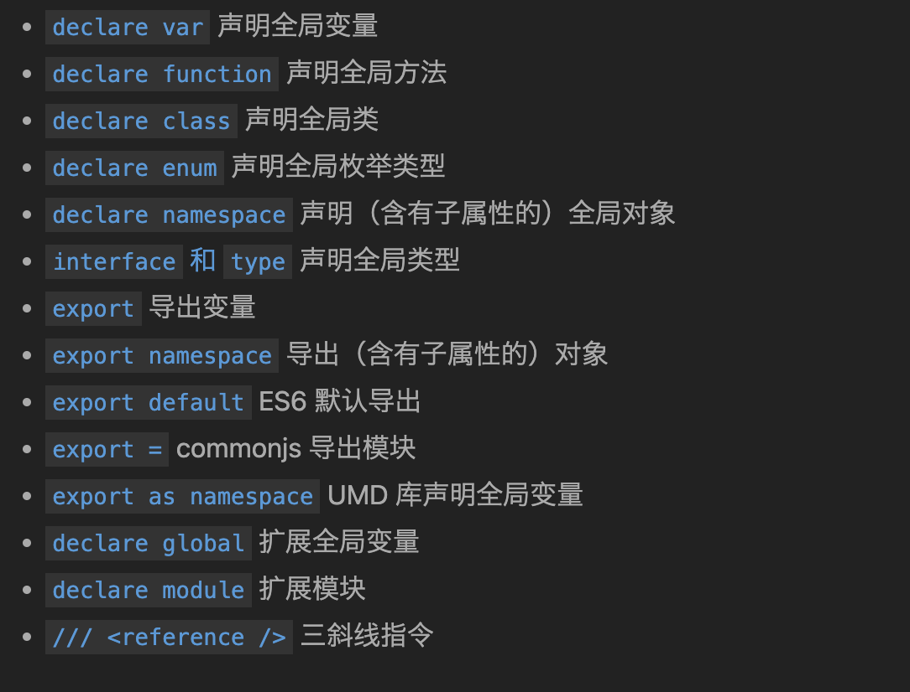

# 基础

## 原始数据类型

JavaScript 的类型分为两种：原始数据类型（Primitive data types）和对象类型（Object types）。

- 原始数据类型包括：布尔值、数值、字符串、null、undefined 以及 ES6 中的新类型 Symbol 和 ES10 中的新类型 BigInt。

### 布尔值

```ts
let isDone: boolean = false;

// let createdByNewBoolean: boolean = new Boolean(1);
// Boolean 返回一个`Boolean`对象
let createdByNewBoolean: Boolean = new Boolean(1);
// 直接调用 Boolean 也可以返回一个 boolean 类型：
let createdByBoolean = new Boolean(1);
```

### 数值

使用 number 定义数值类型

### 字符串

```ts
let myName: string = 'Tom';
let myAge: number = 25;

// 模板字符串
let sentence: string = `Hello, my name is ${myName}.
I'll be ${myAge + 1} years old next month.`;
console.log(sentence)
```

### 空值

- 在 TypeScript 中，可以用 void 表示没有任何返回值的函数
- 声明一个 void 类型的变量没有什么用，因为你只能将它赋值为 undefined 和 null（只在 --strictNullChecks 未指定时）
  - [TODO] 什么是strictNullChecks

### Null 和 Undefined

- 使用 null 和 undefined 来定义这两个原始数据类型
- 与 void 的区别是，undefined 和 null 是所有类型的子类型。也就是说 undefined 类型的变量，可以赋值给 number 类型的变量

## 任意值

任意值（Any）用来表示允许赋值为任意类型。

### 什么是任意值类型

如果是一个普通类型，在赋值过程中改变类型是不被允许的，但如果是 any 类型，则允许被赋值为任意类型。

### 任意值的属性和方法

在任意值上访问任何属性都是允许的，可以认为，声明一个变量为任意值之后，对它的任何操作，返回的内容的类型都是任意值。

## 类型推论

- 如果没有明确的指定类型，那么 TypeScript 会依照类型推论（Type Inference）的规则推断出一个类型。
- 定义的时候没有赋值，不管之后有没有赋值，都会被推断成 any 类型而完全不被类型检查

## 联合类型

- 联合类型使用 | 分隔每个类型。
- 当 TypeScript 不确定一个联合类型的变量到底是哪个类型的时候，我们只能访问此联合类型的所有类型里共有的属性或方法
- 联合类型的变量在被赋值的时候，会根据类型推论的规则推断出一个类型

## 接口

- TypeScript 中的接口是一个非常灵活的概念，除了可用于对类的一部分行为进行抽象以外，也常用于对「对象的形状（Shape）」进行描述。
- 定义的变量比接口少了一些属性是不允许的， 多一些属性也是不允许
- 可选属性
  - 在属性后面添加 `?`
- 任意属性
  - 一旦定义了任意属性，那么确定属性和可选属性的类型都必须是它的类型的子集
- 只读属性：只读的约束存在于第一次给对象赋值的时候，而不是第一次给只读属性赋值的时候

## 数组

- 类型 + 方括号
- 类数组？ & 用接口表示数组？

## 函数

- 函数和函数表达式
- 选参数必须接在必需参数后面。换句话说，可选参数后面不允许再出现必需参数了
- 我们允许给函数的参数添加默认值，TypeScript 会将添加了默认值的参数识别为可选参数
- 剩余参数 `...rest`
- 重载

## 类型断言

- `值 as 类型` 或者 `<类型>值`
- 将任何一个类型断言为 any
  - 将一个变量断言为 any 可以说是解决 TypeScript 中类型问题的最后一个手段。它极有可能掩盖了真正的类型错误，所以如果不是非常确定，就不要使用 as any
  - 一方面不能滥用 as any，另一方面也不要完全否定它的作用，我们需要在类型的严格性和开发的便利性之间掌握平衡点。
- 将 any 断言为一个具体的类型
- 类型断言的限制: 若 A 兼容 B，那么 A 能够被断言为 B，B 也能被断言为 A
  - `Animal` 兼容 `Cat`
  
  ```ts
    interface Animal2 {
      name: string;
    }

    interface Cat2 {
        name: string;
        run(): void;
    }

    let tom4: Cat2 = {
        name: 'Tom3',
        run: () => { console.log('run'); }
    };
    // TypeScript 并不关心 Cat 和 Animal 之间定义时是什么关系，而只会看它们最终的结构有什么关系——所以它与 Cat extends Animal 是等价的：
    let animal: Animal2 = tom4;
  ```
- 类型断言 vs 类型转换
  - 类型断言只会影响 TypeScript 编译时的类型，类型断言语句在编译结果中会被删除
  - 若要进行类型转换，需要直接调用类型转换的方法
- 类型断言 vs 类型声明
  - animal 断言为 Cat，只需要满足 Animal 兼容 Cat 或 Cat 兼容 Animal 即可
  - animal 赋值给 tom，需要满足 Cat 兼容 Animal 才行

## 声明文件

当使用第三方库时，我们需要引用它的声明文件，才能获得对应的代码补全、接口提示等功能。




## 内置对象